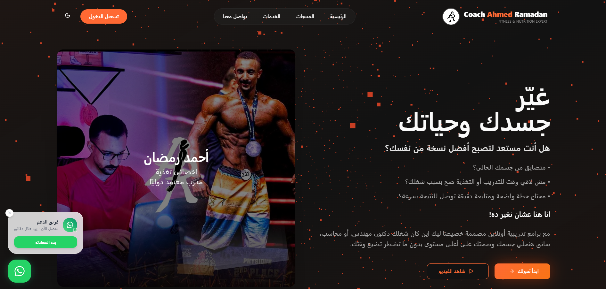
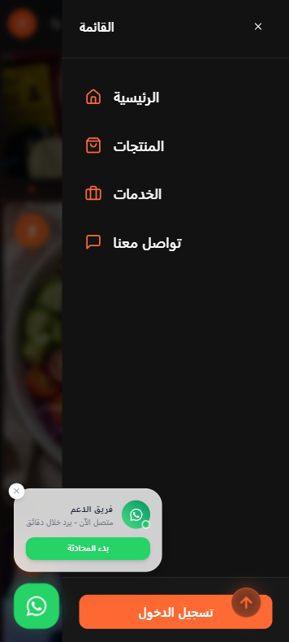
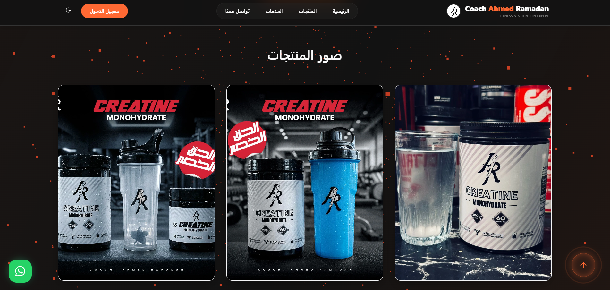
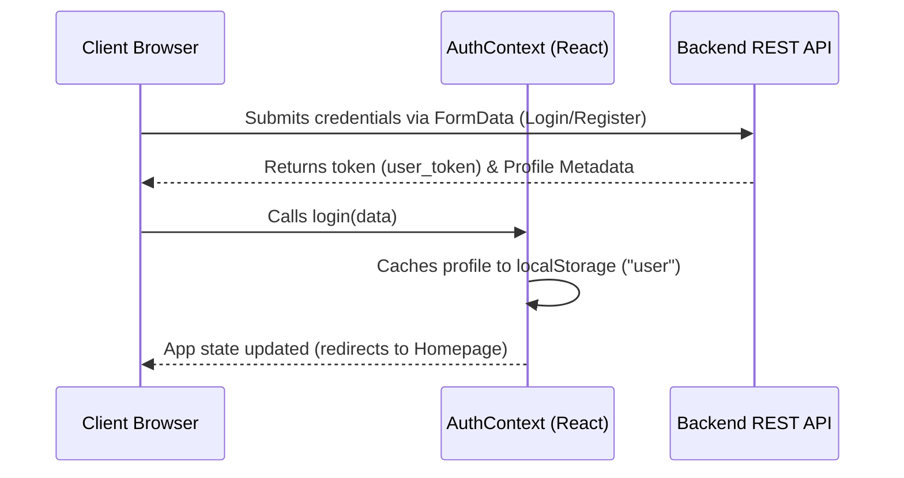

# 🏋️‍♂️ Coach Ahmed Ramadan - Online Fitness Coaching Portal

[](https://vitejs.dev/)
[](https://react.dev/)
[](https://www.typescriptlang.org/)
[](https://tailwindcss.com/)
[](https://github.com/pmndrs/zustand)
[](https://threejs.org/)

---

### 🎨 Professional Banner Suggestion

> **Recommended Banner:** A sleek, dark-mode action photograph of Coach Ahmed Ramadan in the gym, featuring the orange branding accent colors (`#ff551d` to `#f97316`) and the logo "AR Fitness / AR Creatine".

---

## 1. Project Title

**Coach Ahmed Ramadan (AR Fitness & AR Creatine Portal)**

---

## 2. Short Description

A high-performance, modern, dark-themed responsive web application designed for **Coach Ahmed Ramadan**, a certified international online fitness coach and nutritionist. The platform enables clients to sign up for customized fitness and nutrition programs, purchase pure **AR Creatine** supplements, watch introductory training videos, track orders, and process payments securely.

---

## 3. Demo / Preview

The application is live and accessible at:
🚀 **[Live Website URL](https://ahmedramadancoach.com/)**

---

## 4. Screenshots Section

|       Desktop Homepage Preview        |        Mobile View & Menu        |           Products Page            |
| :-----------------------------------: | :------------------------------: | :--------------------------------: |
|  |  |  |

_The following screenshots showcase the responsive storefront experience, mobile navigation flow, and streamlined checkout interface._

---

## 5. Features

- **✨ Visual Excellence:** Premium "Orange-Neon" dark mode aesthetic with responsive grids and interactive backgrounds.
- **✨ Interactive Background & Particles:** Integrated `@react-three/fiber` (Three.js) and `@tsparticles/react` for dynamic particle configurations.
- **🔐 Secure Authentication:** Seamless user login and registration flows linked to the central REST API.
- **🛒 Dynamic Supplement & Plan Store:** Live product grid containing AR Creatine variants and customized VIP/Eco coaching subscription plans with real-time price difference calculations (amount saved).
- **💳 Instant Payments:** Automatic invoice generation which opens a secure payment portal and guides the user through to checkout.
- **🟢 Order Confirmation via WhatsApp:** Automated redirection to WhatsApp for final order dispatch and communication with the coach.
- **🎥 Multimedia Modals:** Embedded video modal to view Coach Ahmed's success story and custom program introduction.
- **📱 Responsive & RTL Native:** Tailored for both Arabic (RTL) reading patterns and mobile-first screens.

---

## 6. Tech Stack

- **Framework:** React 18 (Vite, TypeScript)
- **Styling & Components:** Tailwind CSS, shadcn/ui components (Radix UI primitives), Lucide Icons
- **State Management:** Zustand (Theme and configuration settings)
- **Data Fetching:** TanStack Query (React Query)
- **Animations:** Framer Motion (Transitions, modals, scroll animations)
- **3D & Visuals:** Three.js, `@react-three/fiber`, `@react-three/drei`, `tsparticles`
- **Forms & Validation:** React Hook Form, Zod validation
- **Charts & Data:** Recharts (Analytics and tracking stats)
- **Package Manager:** `npm` / `bun`

---

## 7. Installation

Follow these steps to set up the project locally:

```bash
# 1. Clone the repository
git clone https://github.com/your-username/coach-ahmed-website.git

# 2. Navigate to the project directory
cd coach-ahmed

# 3. Install dependencies (npm or bun)
npm install
# OR
bun install
```

---

## 8. Environment Variables

Create a `.env` file in the root directory and specify the backend API URL:

```env
# Production REST API base endpoint
VITE_BASE_API=https://api.ahmedramadancoach.com
```

> [!IMPORTANT]
> Ensure the base API URL does not end with a trailing slash (`/`). The application appends endpoints dynamically (e.g., `${BASE_API}/user/login`).

---

## 9. Running the Project

### Development Server

Run the local server with hot-reload enabled:

```bash
npm run dev
# OR
bun run dev
```

### Production Build

Compile and optimize the assets for production deployment:

```bash
npm run build
# OR
bun run build
```

### Preview Production Build

Locally preview the generated production files:

```bash
npm run preview
# OR
bun run preview
```

---

## 10. Folder Structure

```text
coach_ahmed/
├── public/                 # Static assets (Favicons, public images)
├── src/
│   ├── assets/             # Images, certificates, videos, sounds
│   │   ├── Working/        # Visual media assets
│   │   ├── products/       # Supplement item thumbnails
│   │   └── testimonials/   # Successful client transform media
│   ├── components/         # Reusable React components
│   │   ├── sections/       # Layout sections (Hero, About, Contact, Services)
│   │   └── ui/             # shadcn core styling components
│   ├── context/            # AuthContext (React authentication provider)
│   ├── hooks/              # Custom React hooks
│   ├── lib/                # Config files (e.g., utils.ts for tailwind-merge)
│   ├── pages/              # Application pages (Index, Login, Register, Products, Payment, NotFound)
│   ├── store/              # Zustand global state (themeStore.ts)
│   ├── App.tsx             # Main App Router and Toast Providers
│   ├── index.css           # Global CSS and Tailwind variables
│   └── main.tsx            # Application entry point
├── package.json            # Dependencies and scripts
├── tailwind.config.ts      # Tailwind styling presets
└── tsconfig.json           # TypeScript configuration
```

---

## 11. API Endpoints

The frontend communicates with the backend via the following main REST endpoints:

### Authentication Endpoints

- **User Registration:**
  - **Endpoint:** `POST ${VITE_BASE_API}/user/register`
  - **Body Format:** `FormData`
  - **Parameters:** `full_name`, `email`, `phone_number`, `password`, `confirm_password`
- **User Login:**
  - **Endpoint:** `POST ${VITE_BASE_API}/user/login`
  - **Body Format:** `FormData`
  - **Parameters:** `phone_number`, `password`

### Orders & Payments

- **Create Order:**
  - **Endpoint:** `POST ${VITE_BASE_API}/user/orders/createOrder`
  - **Body Format:** `FormData`
  - **Parameters:** `user_token`, `product_id`, `quantity`
  - **Response:** Returns `order_code`, `total_amount`, `payment_url`
- **Check Payment Status:**
  - **Endpoint:** `GET ${VITE_BASE_API}/user/orders/checkPayment?invoice_id={ID}`
  - **Response:** Returns payment status (`paid`, `unpaid`, `pending`, `failed`) and `whatsapp_url`

---

## 12. Authentication Flow



1. **State Persistence:** User login status is saved inside the global `AuthContext` state.
2. **Local Caching:** On login, the user's data object including their unique `user_token` is cached inside `localStorage` under the key `"user"`.
3. **Session Verification:** During application load, `AuthContext` automatically reads from `localStorage` to retain active user sessions.
4. **Order Authorization:** The user's token is attached as Form Data for order creation endpoints.

---

## 13. Deployment

The portal is optimized for deployment on **Vercel** or **Netlify**.

To deploy manually via the Vercel CLI:

```bash
# Install Vercel globally
npm install -g vercel

# Login and deploy
vercel
```

Make sure to configure the Environment Variable `VITE_BASE_API` inside your Vercel Dashboard settings.

---

## 14. Future Improvements

- **🔒 Stripe/Fawry Webhook Integration:** Automate webhook callbacks to confirm successful transactions without manual check page updates.
- **📊 Fitness Progress Dashboard:** Allow clients to upload weekly photos, update their weight logs, and monitor body composition charts.
- **💬 Direct In-App Chat:** Replace generic WhatsApp redirection with a custom WebSockets-powered chat module for instant coach-client messaging.
- **🛒 Persistent Shopping Cart:** Allow batch orders of multiple supplement combinations with a single unified checkout invoice.

---

## 15. Contributing

1. Fork the repository.
2. Create a feature branch: `git checkout -b feature/cool-new-feature`.
3. Commit your changes: `git commit -m 'Add some cool features'`.
4. Push to the branch: `git push origin feature/cool-new-feature`.
5. Open a Pull Request.

---

## 16. License

This project is licensed under the **MIT License**. See the [LICENSE](LICENSE) file for more information.

---

## 17. Contact Information

- **Coach:** Ahmed Ramadan (أحمد رمضان)
- **Instagram:** [@coachahmedramadan](https://www.instagram.com/coachahmedramadan)
- **Facebook:** [@coachahmedramadan](https://www.facebook.com/coachahmedramadan)
- **Direct Enquiries (WhatsApp):** +20 102 845 4284 / +20 104 052 8061
  "# coach-ahmed-website"
"# coach-ahmed-website" 
